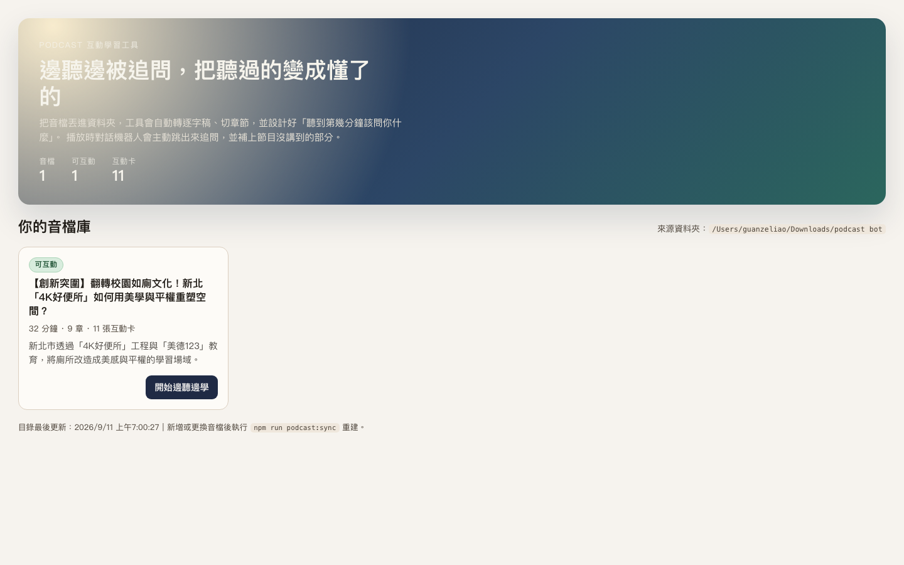
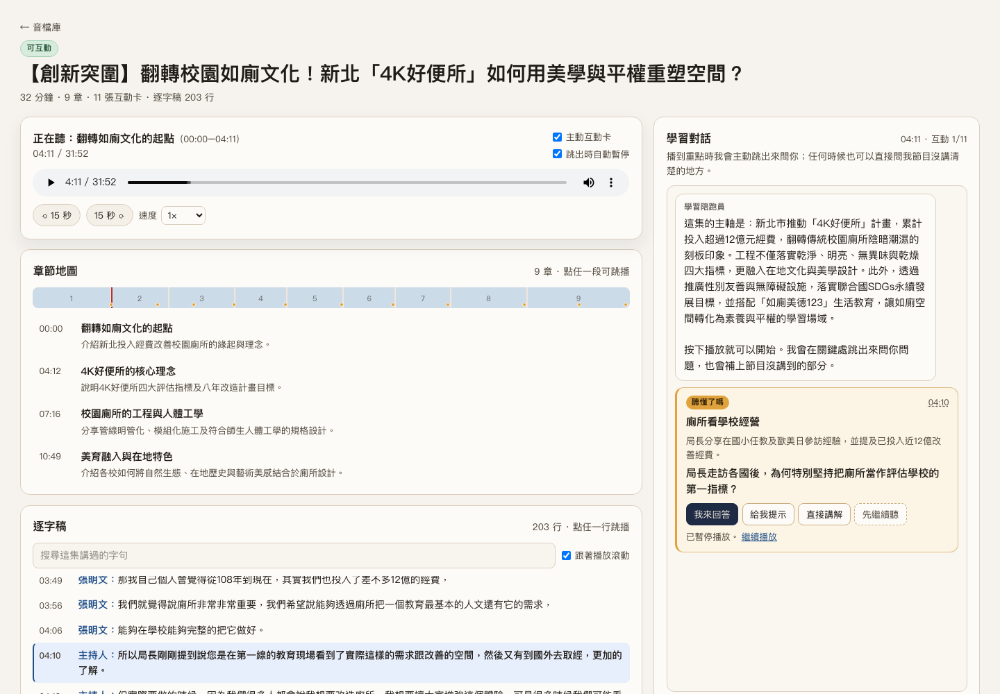
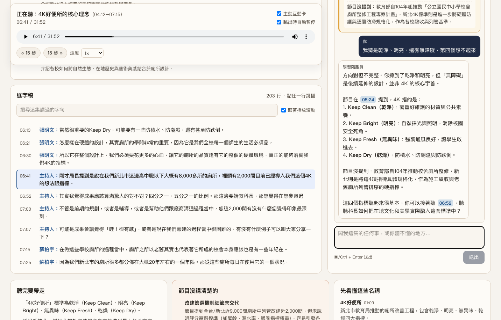

# 聽懂學習廳 — Podcast 互動學習工具

把一個資料夾裡的 Podcast 音檔，自動變成「邊聽、邊被 AI 追問」的學習頁面。

音檔丟進資料夾 → 執行一行指令 → 系統自動轉逐字稿、切章節、設計好「聽到第幾分幾秒該問你什麼」。
播放時對話機器人會**主動跳出來提問**，並補上節目沒講到的背景知識。

---

## 畫面

> **示範內容出處**
> 以下截圖的節目內容取自 Podcast 節目《創新突圍》第 4737 集
> 〈翻轉校園如廁文化！新北「4K好便所」如何用美學與平權重塑空間？〉，主持人劉傑中，
> 該集由新北市政府教育局合作推薦。著作權屬原節目製作方所有。
>
> 此處僅為展示本工具功能所必要之引用（《著作權法》第 52 條、第 65 條），
> 截圖中可見的逐字稿約 598 字，占該集全文（9,848 字）約 6%。
> **本專案不提供該節目的音檔，也不提供完整逐字稿。**

### 1. 音檔庫

資料夾裡的每一集都會列出來，顯示長度、章節數與互動卡數量。



### 2. 邊聽邊被追問

播到關鍵處，右側會自動跳出互動卡（可設定同時暫停播放）。
左側同步顯示章節地圖（時間軸上的橘點就是互動卡位置）與逐字稿（自動跟著播放捲動）。



### 3. 回答後即時獲得回饋

按「我來回答」寫下你的理解，AI 會判斷你答對多少、補上你漏掉的重點，
並明確區分「節目講過的」與「節目沒提到、但你該知道的」。
回覆中的時間戳（如 `05:24`）可以點，會直接跳到音檔那一秒。



---

## 它解決什麼問題

聽 Podcast 很被動：聽過了，但不確定自己有沒有聽懂；節目講得不清楚的地方，也不會有人替你補。

這個工具把「聽」變成「對話」：

| 互動卡類型 | 它會做什麼 |
| --- | --- |
| 聽懂了嗎 | 確認剛講過的關鍵事實或數字有沒有聽進去 |
| 追問原因 | 逼你講出背後的原因或機制 |
| 換成你的情境 | 要你把結論套用到自己的處境 |
| 節目沒講的 | 補上節目略過、但理解主題需要的背景 |
| 反面思考 | 代價、反例、不同立場 |

每張卡都可以選「我來回答」、「給我提示」、「直接講解」或「先繼續聽」。
提示與解答是事前產生好的，點下去**立即顯示、不花錢也不用等**；只有你真的打字提問時才會呼叫 API。

---

## 運作流程

```
你的音檔資料夾（.mp3 / .m4a / .wav / .aac / .flac / .ogg）
        │
        │   npm run podcast:sync
        ▼
┌────────────────────────────────────────────────────┐
│  scripts/podcast/build-catalog.mjs                 │
│                                                    │
│  0. 掃描資料夾 → 解析音檔長度（不需要 ffmpeg）        │
│     → 以 hardlink 連到 public/media（不佔額外空間）   │
│  1. Pass A 章節地圖    ← 整段音檔送進 Gemini          │
│  2. Pass B 逐字稿      ← 帶時間戳，會自動續寫到結尾    │
│  3. Pass C 互動腳本    ← 只吃文字，最便宜              │
│     「第幾分幾秒該問什麼、節目漏了什麼」                │
└────────────────────────────────────────────────────┘
        │
        │   data/episodes.generated.json
        ▼
   網站（Next.js）
     /                 音檔庫
     /episodes/<id>    播放器＋章節地圖＋逐字稿＋對話機器人
```

三個 pass 與音檔上傳結果都會快取在 `.cache/podcast/`，**重跑同一個檔案不會再次計費**。
逐字稿是**每轉完一輪就存一次**，所以中途失敗再跑一次會從上次的時間點接著補，不會從頭來過。

---

## 安裝

### 環境需求

- Node.js 22.13 以上（建議 22 或 24）
- 一組 Google Gemini API 金鑰

### 步驟

```bash
git clone https://github.com/canlgz/podcast-learning.git
cd podcast-learning
npm install
```

建立設定檔：

```bash
cp .env.example .env.local
```

用編輯器打開 `.env.local`，填入兩個東西：

```bash
# 1. 你的金鑰（到 https://aistudio.google.com/apikey 申請，有免費額度）
GEMINI_API_KEY=貼在這裡

# 2. 你放音檔的資料夾絕對路徑
PODCAST_SOURCE_DIR=/Users/你的帳號/Downloads/podcast
```

> 注意：等號前後不要空格、金鑰不要加引號。
> `.env.local` 已被 `.gitignore` 排除，不會被 commit 上去。

確認金鑰有讀到：

```bash
npm run podcast:dry
```

會列出資料夾裡找到哪些音檔、以及會不會進行分析，但不呼叫 API、不花錢。

---

## 加一集新節目要怎麼做

這是最常用的流程，三步：

### 第 1 步 — 把音檔放進來源資料夾

放到 `.env.local` 裡 `PODCAST_SOURCE_DIR` 指定的那個資料夾，例如：

```
/Users/你的帳號/Downloads/podcast/
├── 第01集-談判的本質.mp3        ← 舊的，已分析過
└── 第02集-如何問對問題.mp3      ← 新丟進來的
```

檔名會直接變成節目標題，建議取有意義的名字。
支援 `.mp3` `.m4a` `.wav` `.aac` `.flac` `.ogg`，也可以再分兩層子資料夾。

### 第 2 步 — 執行分析

```bash
npm run podcast:sync
```

它只會處理**新的或改過的**檔案，已分析過的自動跳過（不重複花錢）。
過程會即時印出進度：

```
▶ 第02集-如何問對問題
  id=ep-a1b2c3d4 長度=28:15 大小=65MB
   ↑ 上傳音檔到 Gemini Files API（65MB）…
   ✓ 已就緒：files/xxxx（6s）
   · pass A 章節地圖（gemini-3.8-flash）: STOP (in 42130 / out 2105 tokens)
   → 8 章、5 個關鍵詞
   · pass B 逐字稿（gemini-3.8-flash）: STOP (in 43022 / out 11890 tokens)
     ↳ 178 行，覆蓋到 28:09
   · pass C 互動腳本（gemini-3.8-flash）: STOP (in 9400 / out 3010 tokens)
   → 10 張互動卡、4 個資訊缺口
  ✓ 完成（ready）耗時 71s，估算花費 US$0.1382
```

一集 30 分鐘的節目大約 **70–90 秒、US$0.15 左右**。

### 第 3 步 — 開啟網站

```bash
npm run dev
```

打開 <http://localhost:5173>，新那一集就在音檔庫裡了。點進去按播放，互動就開始。

> 網站已經開著的話，**新增節目後要重新整理頁面**才會看到。
> 修改 `.env.local` 則需要重啟 `npm run dev`。

### 想讓它自動偵測新檔案

```bash
npm run podcast:sync:watch
```

會常駐監看資料夾，預設每 2 分鐘掃一次，丟新檔進去就自動分析。

---

## 指令一覽

| 指令 | 用途 |
| --- | --- |
| `npm run podcast:sync` | 掃描並分析新音檔（已完成的跳過） |
| `npm run podcast:dry` | 只列出會處理什麼，不呼叫 API、不花錢 |
| `npm run podcast:cheap` | 略過逐字稿，只做章節＋互動卡（最省錢） |
| `npm run podcast:rebuild` | 忽略快取全部重跑（會重新計費） |
| `npm run podcast:sync:watch` | 常駐監看資料夾，有新檔就自動分析 |
| `npm run dev` | 啟動網站（http://localhost:5173） |
| `npm run build` | 打包正式版 |

更細的選項可以直接呼叫腳本：

```bash
node scripts/podcast/build-catalog.mjs \
  --source "/path/to/folder" \       # 換一個來源資料夾
  --only 第02集 \                     # 只處理檔名含關鍵字的
  --limit 3 \                        # 這次最多處理 3 個新檔
  --model gemini-3.5-flash-lite \    # 章節與互動卡用的模型
  --transcribe-model gemini-3.8-flash \ # 逐字稿另外指定模型
  --fallback-models gemini-3.7-flash,gemini-3.6-flash \ # 主模型滿載時的備援順序
  --max-rounds 8                     # 長節目逐字稿續寫上限
```

---

## 成本

費用主要來自音訊輸入（Pass A、B 各讀一次音檔，約 25 tokens／秒）與逐字稿的輸出 token。
預設模型 `gemini-3.8-flash` 單價為輸入 $0.75、輸出 $3.75（每 1M tokens，2026 年底前）。

實測一集 **31 分 52 秒** 的節目：三個 pass 合計 **約 US$0.15**。
每集跑完都會印出實際 token 與估算費用，也記在 `data/episodes.generated.json` 的 `stats.costUsd`。

想更省：

- `GEMINI_MODEL=gemini-3.5-flash-lite`（便宜約 2.5 倍）
- `npm run podcast:cheap` 不做逐字稿（對話改用章節摘要，會少掉精準引用）
- 重跑時不要加 `--force`：三個 pass 與上傳結果都有快取

---

## 模型選擇（2026-09 實測）

Google 的模型世代換得很快，**新申請的金鑰拿不到 `gemini-2.5-*`**（API 會回 404 並說
「no longer available to new users」）。本專案實測結果：

| 模型 | 可用性 | 說明 |
| --- | --- | --- |
| `gemini-3.8-flash` | ✅ 可用 | **預設值**。音訊理解、JSON 結構化輸出、時間戳都正常 |
| `gemini-3.7-flash` / `gemini-3.6-flash` | ✅ 同價位 | 3.8 遇到尖峰 503 時的備援 |
| `gemini-3.5-flash-lite` | ✅ 最便宜 | $0.30 / $2.50 |
| `gemini-3.1-pro-preview` | ⚠️ 需付費帳戶 | 價目表上**沒有公布價格**，帳單不可預測 |
| `gemini-3.5-transcribe` | ⚠️ 不適用 | 轉錄品質好，但不支援 JSON mode、**不輸出時間戳**、預設簡體中文 |
| `gemini-2.5-pro` / `gemini-2.5-flash` | ❌ 新金鑰不可用 | 只有既有帳號還能呼叫 |

### 遇到 503「high demand」會怎麼處理

尖峰時段 Gemini 會回 `503 UNAVAILABLE / This model is currently experiencing high demand`。
這是 Google 那邊暫時滿載，不是音檔或設定的問題。腳本會自己吞掉它：

1. **重試**：最多 8 次、退避從 2 秒拉到 45 秒，總預算 5 分鐘（舊版只撐 10 秒就放棄）。
2. **換模型**：重試完還是不行，就依備援清單換一個模型接著跑，並把實際用到的模型記進
   `stats.actualModels` 和 `stats.notes`。`404`（金鑰拿不到這個模型）和 `429`（配額用盡）同樣會觸發。
3. **保住已完成的部分**：逐字稿某一輪掛掉時，前面轉好的段落會留著，該集標成 `partial`
   而不是整集 `failed`；下次重跑從斷點接著補，補齊後互動卡也會自動重做一份。

備援順序預設是 `gemini-3.8-flash → 3.7 → 3.6 → 3.5-flash-lite`，
可用 `GEMINI_FALLBACK_MODELS` 或 `--fallback-models` 改。
重試預算可用 `GEMINI_RETRY_BUDGET_MS` / `GEMINI_MAX_BACKOFF_MS` 調。

---

## 專案結構

```
scripts/podcast/
  build-catalog.mjs      主流程：掃檔 → 三個 pass → 寫出 catalog
  ensure-catalog.mjs     剛 clone 時補一個空 catalog，讓網站能啟動
  lib/
    gemini.mjs           Gemini client：Files API 上傳、重試、費用計算
    passes.mjs           三個 pass 的 prompt、JSON schema 與正規化
    audio-meta.mjs       純 JS 解析音檔長度（mp3 / wav / m4a，不需 ffmpeg）
    cache.mjs            以檔案指紋為 key 的分段快取
    env.mjs              讀取 .env.local

app/
  page.tsx               音檔庫
  episodes/[slug]/       單集頁
  api/chat/route.ts      對話 API（串流、限定用這集內容回答）
  api/episodes/route.ts  目錄狀態

components/podcast/
  episode-workspace.tsx  播放器狀態、互動卡排程、對話流程
  learning-chat.tsx      對話面板
  cue-card.tsx           互動卡
  chapter-rail.tsx       章節時間軸
  transcript-panel.tsx   逐字稿（搜尋、跟播捲動、點擊跳播）
  chat-text.tsx          把回覆裡的 [12:34] 轉成可點的時間戳
```

---

## 已知限制

- 時間戳由模型聽出來，長節目後段可能有幾秒偏移；逐字稿每一行都可點播，容易自行校正。
- 逐字稿偶爾會寫錯專有名詞（實測出現過把人名「劉傑中」寫成「劉捷中」）。章節地圖那一關通常是對的，可互相對照。
- 互動卡的「節目沒提到」補充來自模型自身知識，**沒有經過查證**。介面上已標明出處是補充而非節目內容，但重要數據建議自行確認。
- 逐字稿是一次性產生後快取，不是即時轉錄。
- 備援模型頂上時，逐字稿快取仍以「你指定的模型」命名；之後重跑會沿用那份內容，不會因為主模型恢復就重轉。
- 對話歷程存在瀏覽器記憶體裡，重新整理就消失。
- `public/media` 是來源檔的 hardlink，不佔額外空間，但跨磁碟時會退回複製。

## 版權說明

**本專案不包含任何 Podcast 音檔或逐字稿。**
`public/media/`（音檔）、`data/episodes.generated.json`（逐字稿與分析結果）與 `.cache/`
都已排除在版控之外，不會隨 repo 散布。

README 截圖中出現的節目內容，出處已標示於「畫面」一節，屬功能展示之必要引用。

使用本工具時請注意：

- 只對你有權使用的音檔進行分析。
- 產生的逐字稿、摘要與互動題目屬於原節目的衍生內容，未經授權請勿公開散布。
- 若要公開分享分析結果，請依《著作權法》第 64 條明示出處。
